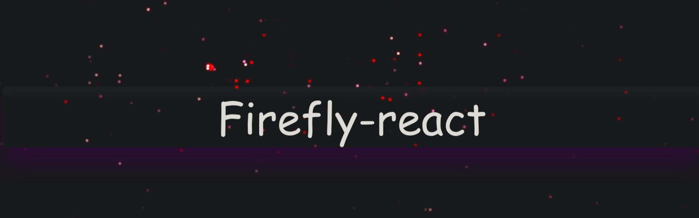

<p style="font-size: 1.5rem">
A React Component for showing interactive animation of fireflies on canvas . As seen on the main page of <a>http://thomso.in</a>
</p>
## Some Highlights :

- ### No external dependecies required ( yeaa ! pure vanilla )
- ### library size is only 16kb , cz Size Matters xxd
- ### Project Uses
  - TypeScript
  - Rollup

## USAGE :

```js
npm i firefly-react
```

Import it into your React Project

```js
import Firefly from "firefly-react";
```

You can add an Array of colors and the fireflies thus generated will get its color(can be hex-code or in rbga format) from this array in a random fashion :

```js
const colors = ["Blue ", "Green", "Red", "Orange"];
```

On every window resize canvas height and width is needed to be updated.

```JSX
const [canvasHeight, setCanvasHeight] = useState(window.innerHeight);
const [canvasWidth, setCanvasWidth] = useState(window.innerWidth);

window.addEventListener(
   "resize",
   (e) => {
   setCanvasHeight(window.innerHeight);
   setCanvasWidth(window.innerWidth);
   },
   false
);
```

The positioning of the **Firefly** component must be done on the app.jsx / app.tsx with the absolute position and height and width of both **Firefly** component and **div** containing Firefly component must updated based on window size.

```JSX
<>
   <div
      className="firefly"
      style={{ height: canvasHeight, width: canvasWidth }}
   >
      <Firefly
         numberOfBirths={10}
         canvasWidth={canvasWidth}
         canvasHeight={canvasHeight}
         colors={colors}
         changeDirectionFrequency={10}
         randomMotion={true}
      />
   </div>
   <div className="textBox">
      <div className="text">Firefly-react</div>
   </div>
</>

// Style
.firefly {
  position: absolute;
  top: 0;
  left: 0;
}
```

## An Illustrative Example

https://codesandbox.io/s/example-firefly-react-yfhg0?file=/src/App.js

## Props :

| Props                    | Value                 | default             | description                                                                                                                                                      |
| ------------------------ | --------------------- | ------------------- | ---------------------------------------------------------------------------------------------------------------------------------------------------------------- |
| numberOfBirths           | [ 1 - 10 ]            | 2                   | this contolls the number of fireflies that will born when the mouse will be moved                                                                                |
| canvasWidth              | [0,SAFE-INT]          | HMTL CANVAS DEFAULT | sets width of the canvas                                                                                                                                         |
| canvasHeight             | [0-SAFE_INT]          | HMTL CANVAS DEFAULT | sets the height of the canvas                                                                                                                                    |
| colors                   | [ ]                   | ["black"]           | fireflies thus generated will be randomly alloted the colors from this array                                                                                     |
| randomMotion             | bool                  | false               | this is the most significant and amazing feature that mimics the random motion of a read world firefly while flying,set to `true` and see the magic              |
| changeDirectionFrequency | [10-120] degree Angle | 30                  | this value controlls how often the firefly will change the direction in random walk motion, this do not do anything alone if randomMotion props is set to false. |

## Want to Contribute ?

Contributing to Open source is self rewarding and i love being part of it , if you too are excited about it , i would love to collaborate :3 .
Currently we need help with :

- Using multithreading concepts to boost our canvas rendering
- particle pooling and hence performance optimization
- I do believe this project has immense potential to offer some good out there , so any proposal for new feature addition would be highly appreciated .
- Strong type checking and dynamic object validation would also make this library robust
